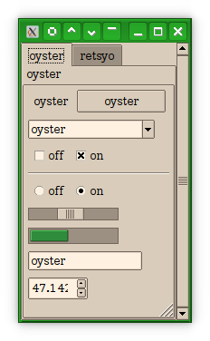

This is the core Ttk theme 'clam' hacked up to look closer to the way I,
personally, want it. This means somewhat red-shifted, in particular with text
rendered black-on-#fef1e1, and with serif fonts where possible without changing
TkDefaultFont. This still lets plenty of uses of TkDefaultFont slip through; for
the full experience, try the following in ~/.config/fontconfig/fonts.conf:

```
<alias>
 <family>sans-serif</family>
  <prefer>
   <family>serif</family>
 </prefer>
</alias>
```

With the demo code at <https://wiki.tcl-lang.org/page/List+of+ttk+Themes>
(bundled here as demottk.tcl, plumbed up to `make test`) you should see
something like:


